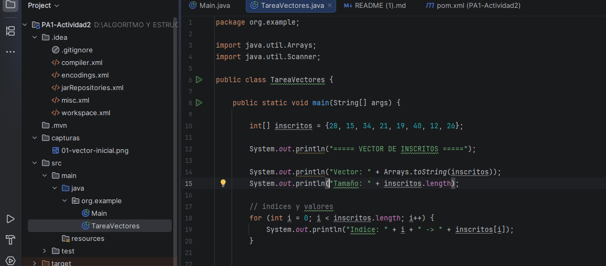
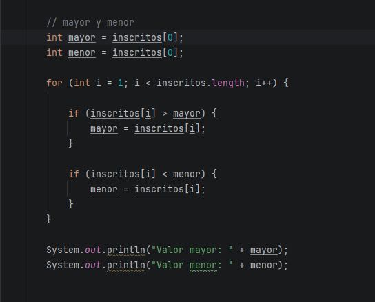
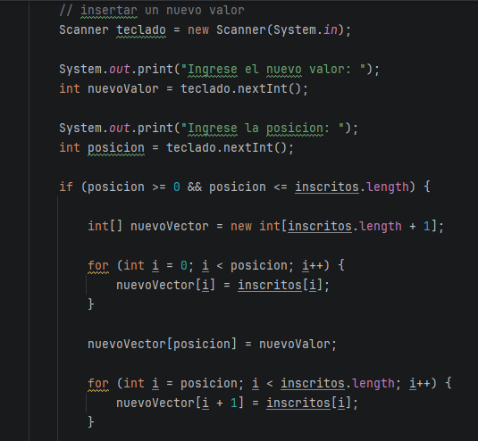
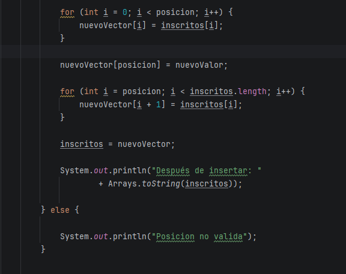
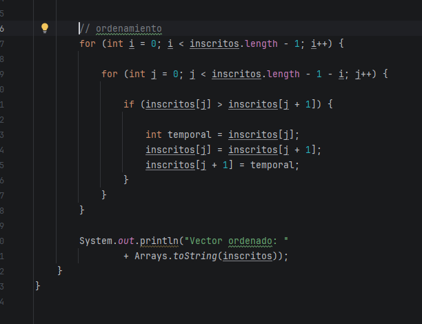

# README — Evaluación

> **Curso:** PROGRAMACION WEB - II  
> **Código:** 30690  
> **Evaluación:** [PA1 / PA2 / PA3 / PA4 / EI]  
> **Equipo:** [NOMBRE O NÚMERO]  

## 1. Integrantes

| Integrante | Rol | Aporte principal |
|---|---|---|
| [Nombre 1] | [Rol] | [Aporte] |
| [Nombre 2] | [Rol] | [Aporte] |
| [Nombre 3] | [Rol] | [Aporte] |
| [Nombre 4] | [Rol] | [Aporte] |
| [Nombre 5] | [Rol] | [Aporte] |

## 2. Descripción y objetivo

**Problema:**  
Se cuenta con un vector que representa la cantidad de inscritos por taller:

`[28, 15, 34, 21, 19, 40, 12, 26]`

Se requiere representar gráficamente el vector indicando sus índices y valores, encontrar el valor mayor y el valor menor, insertar un nuevo valor en una posición indicada por el usuario y ordenar los elementos de menor a mayor.

**Objetivo:**  
Aplicar los conocimientos adquiridos sobre arreglos unidimensionales en Java, utilizando recorridos, comparaciones, inserción de elementos y algoritmos de ordenamiento.


**Solución desarrollada:**  
Se desarrolló un programa en Java utilizando IntelliJ IDEA. El programa trabaja con el vector de inscritos y realiza las siguientes operaciones:

- Muestra los índices y valores del vector.
- Recorre el vector para encontrar el valor mayor y el menor.
- Solicita mediante `Scanner` un nuevo valor y la posición donde se desea insertar.
- Crea un nuevo vector con una posición adicional para realizar la inserción.
- Ordena el vector de menor a mayor utilizando el algoritmo Bubble Sort.
- Muestra los resultados en la terminal.


### Representación del vector

| Índice | 0 | 1 | 2 | 3 | 4 | 5 | 6 | 7 |
|---|---:|---:|---:|---:|---:|---:|---:|---:|
| Valor | 28 | 15 | 34 | 21 | 19 | 40 | 12 | 26 |

El vector contiene **8 elementos**.

El valor mayor encontrado es **40** y el valor menor es **12**.

### Inserción de un nuevo valor

Para insertar un elemento se solicita al usuario el nuevo valor y la posición mediante `Scanner`.

Como los arreglos en Java tienen un tamaño fijo, se crea un nuevo vector con una posición adicional. Luego se copian los elementos correspondientes y se inserta el nuevo valor en la posición indicada.

Por ejemplo, si se ingresa:

```text
Nuevo valor: 30
Posición: 3
```

El resultado será:

```text
[28, 15, 34, 30, 21, 19, 40, 12, 26]
```

### Ordenamiento

Para ordenar los valores de menor a mayor se utiliza el algoritmo **Bubble Sort**.

Este algoritmo compara elementos vecinos. Si el elemento de la izquierda es mayor que el de la derecha, sus posiciones se intercambian utilizando una variable temporal.

Con el vector original, el resultado es:

```text
[12, 15, 19, 21, 26, 28, 34, 40]
```

### Costo aproximado del ordenamiento

En la versión de Bubble Sort utilizada se realizan recorridos mediante dos ciclos `for`.

**Mejor caso:**  
Si el vector ya se encuentra ordenado, se realizan las comparaciones aunque no sea necesario realizar intercambios. El costo aproximado es **O(n²)**.

**Peor caso:**  
Si el vector se encuentra en orden inverso, se realizan las comparaciones y una mayor cantidad de intercambios. El costo aproximado también es **O(n²)**.

Por lo tanto, la principal diferencia entre ambos casos está en la cantidad de intercambios realizados.

El proyecto fue desarrollado utilizando **Java en IntelliJ IDEA**.

```bash
# Ejecutar la clase TareaVectores
# desde IntelliJ IDEA.
```

**Pasos de revisión:**
1. Abrir el proyecto en IntelliJ IDEA.
2. Ubicar y ejecutar la clase `TareaVectores`.
3. Revisar en la terminal la representación del vector, el valor mayor y el menor.
4. Ingresar el nuevo valor solicitado por el programa.
5. Ingresar la posición donde se desea insertar.
6. Verificar el nuevo vector generado.
7. Revisar el resultado final ordenado de menor a mayor.

> No publicar contraseñas, tokens, credenciales ni datos sensibles.


## 4. Evidencias

Agregar aquí capturas, resultados, pruebas o enlaces que demuestren el funcionamiento.

- [CODIGO]
package org.example;

import java.util.Arrays;
import java.util.Scanner;

public class TareaVectores {

    public static void main(String[] args) {

        int[] inscritos = {28, 15, 34, 21, 19, 40, 12, 26};

        System.out.println("===== VECTOR DE INSCRITOS =====");

        System.out.println("Vector: " + Arrays.toString(inscritos));
        System.out.println("Tamaño: " + inscritos.length);

        // índices y valores
        for (int i = 0; i < inscritos.length; i++) {
            System.out.println("Indice: " + i + " -> " + inscritos[i]);
        }


        // mayor y menor
        int mayor = inscritos[0];
        int menor = inscritos[0];

        for (int i = 1; i < inscritos.length; i++) {

            if (inscritos[i] > mayor) {
                mayor = inscritos[i];
            }

            if (inscritos[i] < menor) {
                menor = inscritos[i];
            }
        }

        System.out.println("Valor mayor: " + mayor);
        System.out.println("Valor menor: " + menor);


        // insertar un nuevo valor
        Scanner teclado = new Scanner(System.in);

        System.out.print("Ingrese el nuevo valor: ");
        int nuevoValor = teclado.nextInt();

        System.out.print("Ingrese la posicion: ");
        int posicion = teclado.nextInt();

        if (posicion >= 0 && posicion <= inscritos.length) {

            int[] nuevoVector = new int[inscritos.length + 1];

            for (int i = 0; i < posicion; i++) {
                nuevoVector[i] = inscritos[i];
            }

            nuevoVector[posicion] = nuevoValor;

            for (int i = posicion; i < inscritos.length; i++) {
                nuevoVector[i + 1] = inscritos[i];
            }

            inscritos = nuevoVector;

            System.out.println("Después de insertar: "
                    + Arrays.toString(inscritos));

        } else {

            System.out.println("Posicion no valida");
        }


        // ordenamiento
        for (int i = 0; i < inscritos.length - 1; i++) {

            for (int j = 0; j < inscritos.length - 1 - i; j++) {

                if (inscritos[j] > inscritos[j + 1]) {

                    int temporal = inscritos[j];
                    inscritos[j] = inscritos[j + 1];
                    inscritos[j + 1] = temporal;
                }
            }
        }

        System.out.println("Vector ordenado: "
                + Arrays.toString(inscritos));
    }
}
- [Evidencia 2] CAPTURAS
### Vector inicial


### Mayor y menor



### Inserción de un nuevo valor




### Vector ordenado



## 5. Matriz de participación

| Integrante | Desarrollo | Pruebas | Documentación | Exposición | Evidencia de participación |
|---|---|---|---|---|---|
| [Nombre 1] | [Alta/Media/Baja] | [Alta/Media/Baja] | [Alta/Media/Baja] | [Sí/No] | [Commits, avances, etc.] |
| [Nombre 2] | [Alta/Media/Baja] | [Alta/Media/Baja] | [Alta/Media/Baja] | [Sí/No] | [Commits, avances, etc.] |
| [Nombre 3] | [Alta/Media/Baja] | [Alta/Media/Baja] | [Alta/Media/Baja] | [Sí/No] | [Commits, avances, etc.] |
| [Nombre 4] | [Alta/Media/Baja] | [Alta/Media/Baja] | [Alta/Media/Baja] | [Sí/No] | [Commits, avances, etc.] |
| [Nombre 5] | [Alta/Media/Baja] | [Alta/Media/Baja] | [Alta/Media/Baja] | [Sí/No] | [Commits, avances, etc.] |

## 6. Video de exposición

**Video público de YouTube:** [PEGAR AQUÍ EL ENLACE]

Todos los integrantes deben participar en la exposición con sus cámaras prendidas y explicar el procedimiento, la solución desarrollada y las decisiones tomadas.

## 7. Conclusiones

- Los vectores permiten almacenar varios elementos del mismo tipo y acceder a ellos mediante índices.
- El recorrido de un vector permite realizar operaciones como encontrar valores mayores y menores, buscar elementos o modificar su contenido.
- Para insertar un nuevo elemento en un arreglo de tamaño fijo se puede crear un nuevo vector con mayor capacidad y desplazar los elementos necesarios.
- El algoritmo Bubble Sort permite ordenar un vector mediante comparaciones e intercambios entre elementos vecinos.
- El Bubble Sort utilizado presenta un costo aproximado de **O(n²)** tanto en el mejor como en el peor caso, aunque la cantidad de intercambios puede ser diferente.

---

**Última actualización:** [DD/MM/AAAA]
